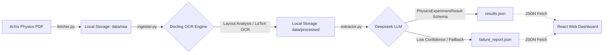

# OptoNet State Space Extractor
## Optoelectronic Neural Network Research Data Pipeline

### Overview
This repository contains a specialized data pipeline built for my research in the state space layer for an optoelectronic neural network. It ingests messy, unstructured scientific data (specifically physics and optics PDFs from arXiv containing complex tables and mathematical equations) and translates them into structured, reliable JSON schemas using a combination of OCR vector analysis and Large Language Models.

While built specifically for this research case, the pipeline's architecture is broadly applicable to large-scale unstructured data extraction tasks.




### Key Objectives Achieved
1. **Automated Ingestion:** Built `fetcher.py` and `ingester.py` utilizing the robust Meta/IBM `Docling` toolkit to parse complex PDFs into machine-readable markdown.
2. **Minimal, Reusable Schemas:** Built `extractor.py` utilizing Pydantic and the OpenAI Structured Outputs API to enforce a strict `PhysicsExperimentResult` schema.
3. **Surface Clear Limits & Failure Modes:** Evaluated the system against extremely dense vector graphics. Handled and isolated `std::bad_alloc` memory errors into a dedicated `failure_report.json`, proving transparency when automation breaks down.

### Quick Start
There are two parts to this project: the Python backend pipeline, and the React visualization frontend. 

**1. The Frontend UI (Live Demo)**
A lightweight, modern React dashboard that visualizes the results of the extraction and the pipeline's failure logs. 
```bash
cd frontend
npm install
npm run dev
```
Navigate to `http://localhost:5173` to see the results.

**2. The Python Pipeline**
To run the extraction pipeline yourself:
```bash
python -m venv venv
source venv/bin/activate
pip install -r requirements.txt
# Add OPENAI_API_KEY to your environment
python src/pipeline.py
```

### Architecture
- **Data Source**: ArXiv queried via Python API
- **Ingestion**: Docling (PyMuPDF/pdfium) 
- **Extraction**: Pydantic / Deepseek `deepseek-chat`
- **Frontend**: React / Vite / TailwindCSS

---

##### **Aayan Shah**
##### CS + Physics @ Colby
